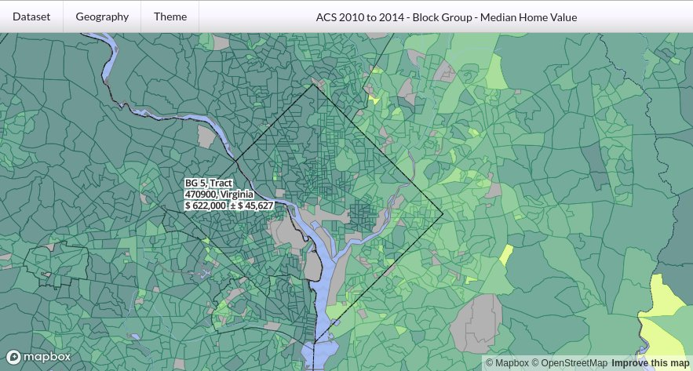

## In Progress

https://royhobbstn.github.io/censusViewer/

## Background

This is (at least) my 3rd take on creating a comprehensive Census / American Community Survey map.  The first was created as part of my Masters Capstone project as a student at the University of Denver (no longer online).  The 2nd version was built for the Colorado State Demography Office, and is still visible here:

https://demography.dola.colorado.gov/CensusAPI_Map/

## Goals

1.  To create a webmap using a modern web mapping library (Mapbox GL JS) - the previous iterations were built using GoogleMaps (capstone) or Leaflet.
2.  To be able to handle both American Community Survey and Decennial Census Datasets in the same application.
3.  To be able to render all the way down the the Census Block Level.
4.  To be able to dynamically handle / display custom data requests (in other words, to have access to the entire dataset, not just a few preselected stats)
5.  To run the entire system as cheaply as possibly by leveraging serverless technologies (S3 and Lambda functions), and free static hosting (Github Pages).

Currently, goals #1, and #5 have been accomplished, and the groundwork for #4 is in place.

## Current TODOs

1. Menu Improvements
2. Legend
3. MOE formula validation / bug fix